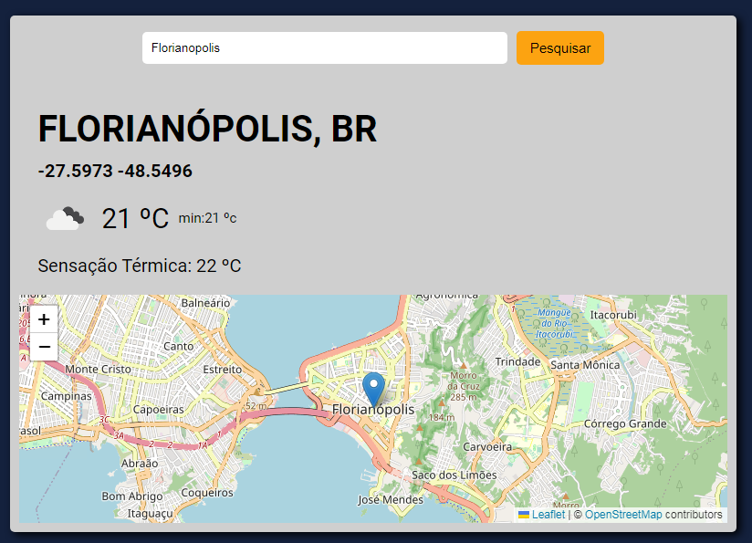

# APP previsão do tempo

Projeto prático de consumo de API. Usuário deve ser capaz de digitar a cidade e ter acesso a previsão do tempo do local e um mapa da cidade.

## API's utilizadas:
- [OpenWeather](https://openweathermap.org/) para acesso das informações do tempo e geolocalização;
- [Leaflet](https://leafletjs.com/) para renderização dos mapas.

## tecnologias utilizadas:
- HTML;
- CSS;
- JAVASCRIPT

